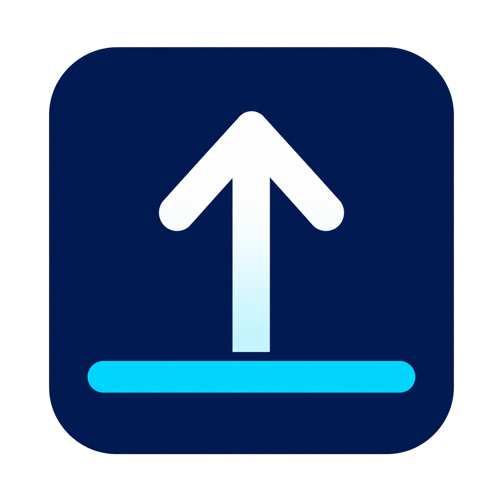

# Taskbar Edge Fixer

[Русский](README.md) | [English](README.en.md)

Небольшая фоновая утилита, которая исправляет проблему Windows, когда
автоматически скрываемая панель задач не появляется при подведении курсора к
нижнему краю экрана.

Проблема особенно часто проявляется при развёрнутых окнах браузеров, включая
Google Chrome, и других приложений. Taskbar Edge Fixer отслеживает нижний край
экрана и аккуратно помогает панели задач появиться, не открывая меню «Пуск» и не
забирая фокус у текущего приложения.

**Версия:** 1.0.0  
**Автор:** [CodoMagia](https://github.com/codomagia)  
**Поддержать:** [Boosty](https://boosty.to/codomagia/donate)

Готовые сборки — в [Releases](https://github.com/codomagia/TaskbarEdgeFixer/releases).

## Демонстрация

## Скачать

1. Откройте [последний Release](https://github.com/codomagia/TaskbarEdgeFixer/releases/latest).
2. Скачайте `TaskbarEdgeFixer-1.0.0.zip`.
3. Распакуйте и запустите `TaskbarEdgeFixer.exe`.

Установка не требуется. Права администратора не нужны.

## Системные требования

- Windows 10 или Windows 11
- 64-битная система (x64)

## Как пользоваться

Запустите `TaskbarEdgeFixer.exe`. Управление — через значок в области
уведомлений.

Для проверки включите автоскрытие панели задач Windows и подведите курсор к
нижнему краю монитора. Если автоскрытие выключено, программа ничего не делает.

### Меню трея

- **Включено** — наблюдение за нижним краем
- **Настройки** — окно параметров
- **О программе** — версия и сведения о программе
- **Выход** — полная остановка

Двойной щелчок по значку открывает настройки.

### Настройки

- **Интервал проверки**
- **Задержка активации**
- **Расстояние повторного взведения**
- **Работать на всех мониторах**
- **Запускать вместе с Windows**
- **Не вызывать панель поверх настоящего полноэкранного приложения**

## Лицензия

Copyright © 2026 CodoMagia. Все права защищены.

Разрешается:
- свободно скачивать и использовать программу;
- распространять неизменённый официальный дистрибутив.

Не допускается:
- изменение программы и распространение изменённых копий;
- выдача программы за чужую или удаление сведений об авторе.
